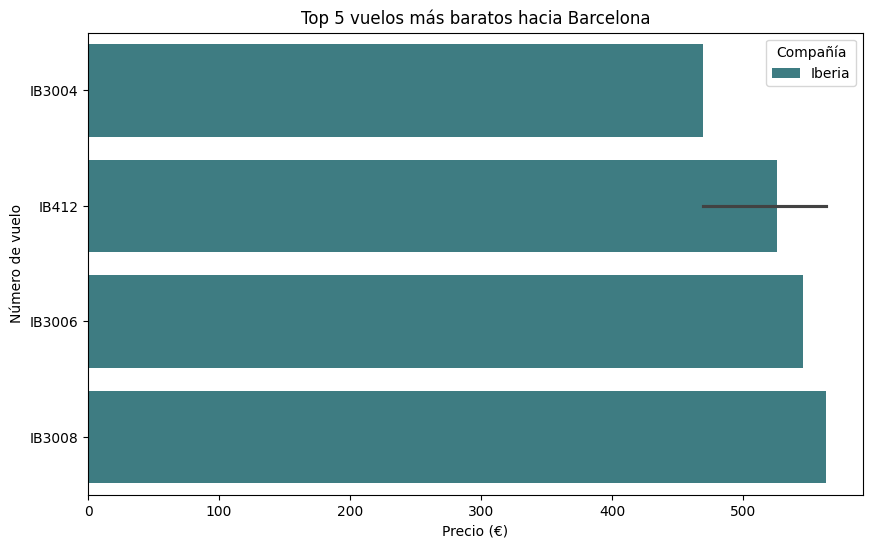
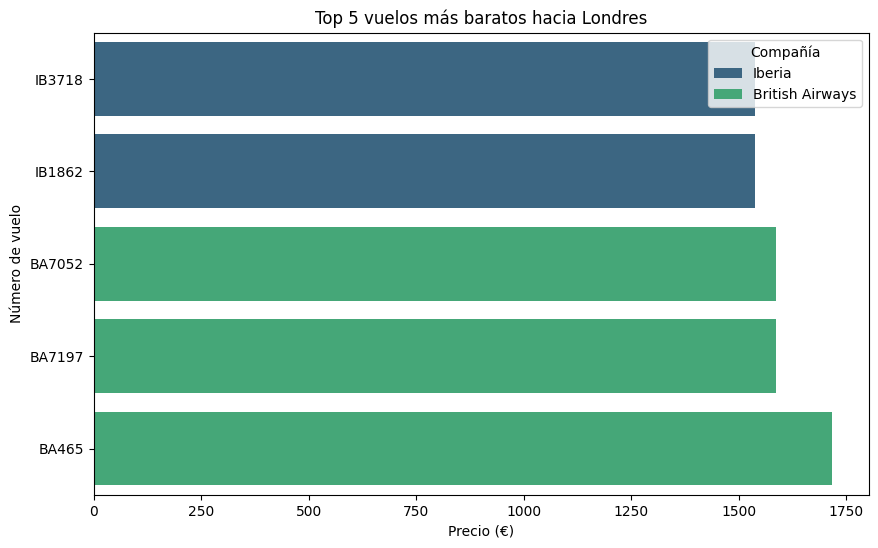
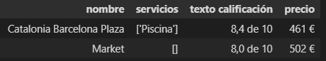
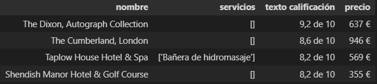
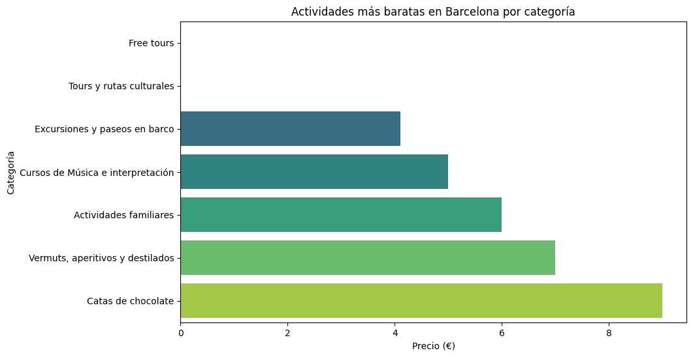
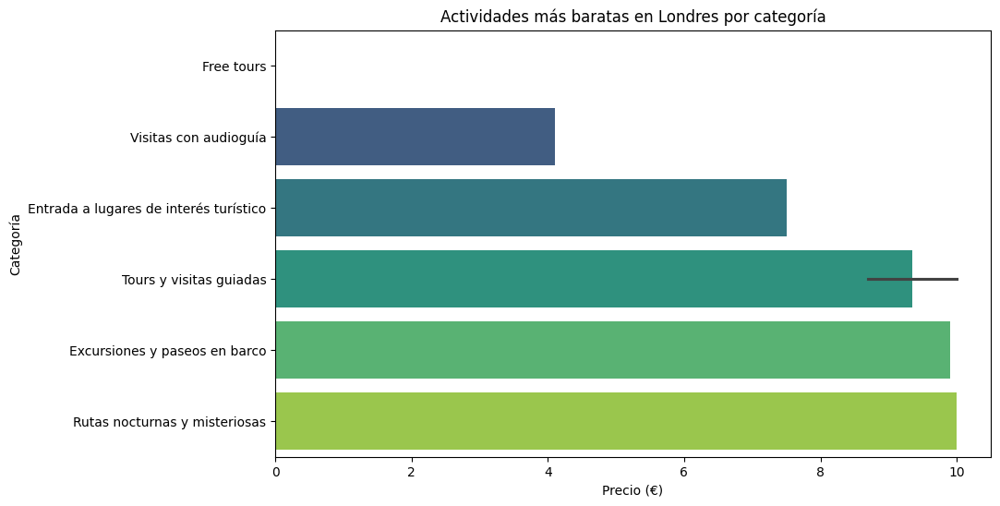

# 📊 Proyecto 3: Explorando Viajes con APIs y Web Scraping: Diseñando las Vacaciones Perfectas

## 📖 Descripción del Proyecto
Este proyecto se centra en analizar y diseñar experiencias de vacaciones optima utilizando datos recopilados mediante APIs y técnicas de Web Scraping. Nos enfocamos en destinos turísticos, vuelos, alojamientos y actividades, con el objetivo de ofrecer a los clientes que buscan economizar una experiencia de viaje inigualable.

## 🎯 Objetivos del proyecto

- Identificar los mejores vuelos, alojamientos y actividades para aventureros que buscan economizar.
- Evaluar las opciones de transporte, alojamiento y actividades locales en al menos dos ciudades seleccionadas.

Este análisis se apoyará en técnicas de limpieza de datos, análisis exploratorio (EDA) y visualización para proporcionar insights que ayuden a las opciones de viaje en un fin de semana.

## 🗂️ Estructura del Proyecto
El proyecto está organizado de la siguiente manera:

```bash
├── datos/                # Conjuntos de datos sin procesar y ya procesados
├── imagenes/             # Recursos gráficos para el proyecto
├── notebooks/            # Notebooks con el contenido y análisis de datos
├── src/                  # Scripts para la limpieza y procesamiento de los datos
├── README.md             # Descripción del proyecto
```

## 🛠️ Instalación y Requisitos
Este proyecto utiliza [Python 3.13]((https://docs.python.org/3.13/)) y requiere las siguientes bibliotecas para la ejecución y análisis:

- [pandas 2.2.3](https://pandas.pydata.org/)
- [numpy 2.0](https://numpy.org/doc/2.0/)
- [matplotlib 3.9.2](https://matplotlib.org/)
- [seaborn 0.13.2](https://seaborn.pydata.org/)
- [beautifulsoup4 4.12.3](https://www.crummy.com/software/BeautifulSoup/)

Para instalar las dependencias, puedes ejecutar el siguiente comando dentro de un entorno virtual:

```bash
pip install -r requirements.txt
```

## 📊 Resultados y Conclusiones

- **Análisis de Vuelos**: Hemos identificado patrones en las frecuencias de vuelo, horarios y precios en las ciudades seleccionadas. Los vuelos más económicos tienden a estar disponibles en ciertos días de la semana, mientras que los precios fluctúan considerablemente durante las temporadas altas.
- **Opciones de Alojamiento**: Se encontraron alojamientos que varían desde hoteles familiares hasta apartamentos turísticos con diferentes precios y servicios. Las categorías de alojamiento más demandadas suelen incluir opciones con desayuno y piscina.
- **Actividades Locales**: Las actividades más populares, como excursiones, visitas culturales y deportes de aventura, varían según el perfil del viajero. Los viajeros en solitario prefieren actividades al aire libre, mientras que los grupos de amigos tienden a elegir opciones más sociales y divertidas.


### Vuelos



- - Conclusion de los vuelos más baratos de *Barcelona*:
    - La gráfica muestra los cinco vuelos más económicos hacia *Barcelona*, todos operados por la aerolínea **Iberia**, con sus respectivos precios.
    Los precios de los vuelos son bastante cercanos entre sí, oscilando en un rango de aproximadamente 500 euros.
    Esto indica que Iberia mantiene una oferta de precios similar para vuelos a **Barcelona**, sin mucha variabilidad en el costo entre diferentes números de vuelo.
    La compañía **Iberia** domina esta lista de vuelos económicos hacia **Barcelona**, sugiriendo que puede tener una posición competitiva o más vuelos en esta ruta específica.



- Conclusión de los vuelos más baratos de *Londres*:
    - Esta gráfica presenta los cinco vuelos más baratos hacia *Londres*, con dos compañías presentes: Iberia y British Airways.
Iberia ofrece precios relativamente más económicos que **British Airways**, que tiene tarifas un poco más altas en este rango.
Los precios de British Airways muestran una diferencia significativa con respecto a **Iberia**, lo cual podría deberse a distintos niveles de servicio o condiciones específicas de la aerolínea.
La presencia de ambas aerolíneas indica una mayor competencia en vuelos hacia *Londres* en comparación con *Barcelona*.


### Hoteles

<table style="text-align: center">
    <tr>
        <th>Mejores hoteles de Barcelona</th>
        <th>Mejores hoteles de Londres</th>
    </tr>
    <tr>
        <th></th>
        <th></th>
    </tr>
</table>

- Conclusión de los mejores hoteles de *Barcelona* y *Londres*:
    - Al realizar la busqueda filtrando por los parametros que nos permitia la API (Lo cual es algo positivo a destacar). Hemos obtenido los mejores hoteles dentro de las zonas centricas de Barcelona y Londres. Podemos ver en el caso de *Barcelona* que son precios medianamente estables, ya que el precio que nos devuelve es el total del fin de semana para dos aventureros adultos. En cuanto a *Londres* podemos ver que el hotel más barato es **Shendish Manor Hotel & Golf Course**, pero si buscamos la relación calidad/precio obtenemos el hotel **The Dixon, Autograph Collection**. Como nos muestran los datos, es el hotel con mejor valoración y el tercero en cuanto a precio más bajo.
    - Podemos ver que la diferencia entre *Barcelona* y *Londres* no difiere en gran distancia.


### Actividades



- Conclusion de las actividades más baratas de *Barcelona*:
    - La gráfica muestra las actividades más económicas en *Barcelona* según la categoría.
    Las actividades de bajo costo incluyen "Free tours" y "Tours y rutas culturales" lo cual es beneficioso para turistas con presupuestos limitados. Eso es lo primero que podemos pensar al ver el gráfico pero esto no es así ya que estas actividades son de pago libre y realizando una busqueda rápida sobre estas actividades en Barcelona desde otras fuentes, podemos ver que normalmente cuesta entre 10 y 25 euros por persona. Por lo que las categorias "Excursiones y paseos en barco" y "Cursos de Música e interpretación" pasarían a ser las categorias más baratas.
    Las categorías como "Catas de chocolate" y "Vermuts, aperitivos y destilados" son un poco más costosas, lo cual puede indicar que estas experiencias tienen un valor adicional o se consideran premium en comparación con las opciones gratuitas.
    La diversidad de categorías permite que los turistas en Barcelona tengan opciones desde actividades gratuitas hasta experiencias gourmet, dependiendo de su presupuesto.



- Conclusión de las actividades más baratas de *Londres*:
    - En Londres, los "Free tours" también son la actividad más accesible, pero nos ocurre exactamente lo mismo que en el caso de las actividades en *Barcelona*. Tras realizar una busqueda exhaustiva en distintas fuentes he podido descubrir que el precio medio de los "Free tours" en *Londres* esta entre 10 y 20 euros por persona. Por lo que la categoría "Visitas con audioguia" pasaría a ser la actividad más barata.
    Las actividades con un costo ligeramente superior incluyen "Tours y visitas guiadas" y "Rutas nocturnas y misteriosas," que podrían ser populares entre los turistas interesados en experiencias únicas.
    La gráfica sugiere que Londres ofrece una variedad de actividades económicas para los turistas, desde visitas culturales accesibles hasta experiencias especiales que requieren una inversión moderada.


## 🔄 Próximos Pasos

- Ampliar la búsqueda de destinos turísticos e incorporar más variables que influyan en la elección de viajes, como el clima o eventos locales.
- Integrar modelos predictivos para anticipar tendencias en precios de vuelos y alojamientos, mejorando la planificación de viajes.
- Proponer estrategias para optimizar las recomendaciones en función de los datos recopilados y los perfiles de clientes.
- Generar gráficos comparativos para ofrecer un producto personalizado para cada cliente.
- Proporcionar a los clientes el tiempo que va a hacer durante la estancia.
- Parametrizar las búsquedas de vuelos y hoteles.

## 🤝 Contribuciones
Las contribuciones son bienvenidas. Si deseas colaborar en este proyecto, por favor abre un pull request o una issue en este repositorio.

## ✒️ Autores
Iván Bravo - Autor principal del proyecto.
